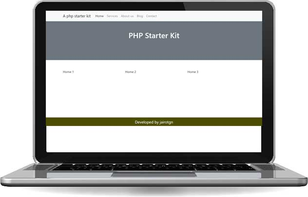

# php-starter
 
### This is a starter includes:
1. PHP native.
2. Bootrstrap 5.2 Built fast css themes.
3. Jquery 3.6 -> Javascript tools

### Base html template structure at '/theme' folder.
1. Base theme: index.php
2. Head: head.php, load css anf js files.
3. Navigation: nav.php
4. Footer: footer.php

### Pages and subpages definition at '/pages' folder.
Example pages: home, services, about-us, blog and contact
Create a new page simply creating new file, example /pages/cars.php  then go to the browser and open server.com/cars.

### Rotuting configuration
Extend your routes a the router.php file.

### Custom tags lang.json 
Define page title and meta description in this file.

