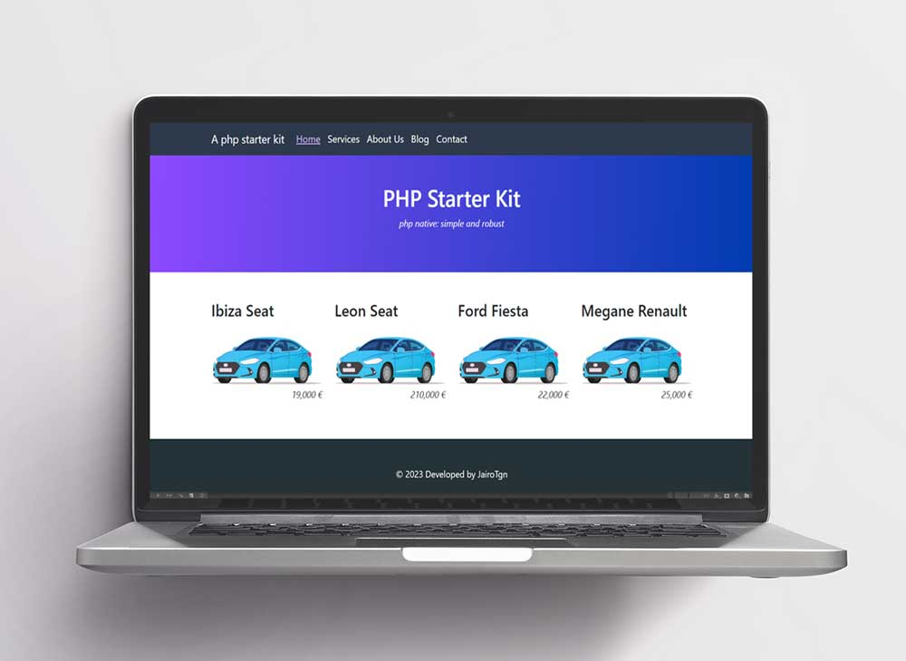

# php-starter
How to start a PHP project? 

This is a basic php system website for extend. 

Includes a basic database ORM.

A simple blog is included.

### Theme features
1. Base theme folder: `/theme`
2. Included Booststrap 5.3 and Jquery
3. Navigation: `/theme/nav.php`, a dynamic navbar from 'lang.json'.

### Database installation
1. Put your database configuration at `config.php`.
2. Import database demo data from `database.sql`.
3. Ready!

### Back-Office Authentication
An administrator panel is available by login page.
Modify credentials in `config.php` file.
Demo credentials: `admin/passbarcelona`.

### Subpages definition at `/pages` folder.
Example pages: home, cars, about-us, blog and contact
Create a new page simply creating new file, example `/pages/cars.php`  then go to the browser and open server.com/cars.

### Navigation 
Extend navigation navbar at `lang.json`.

### Routing configuration
Extend your routes a the `router.php` file.

### Custom tags `lang.json`
Define page title page and meta description in this file.

